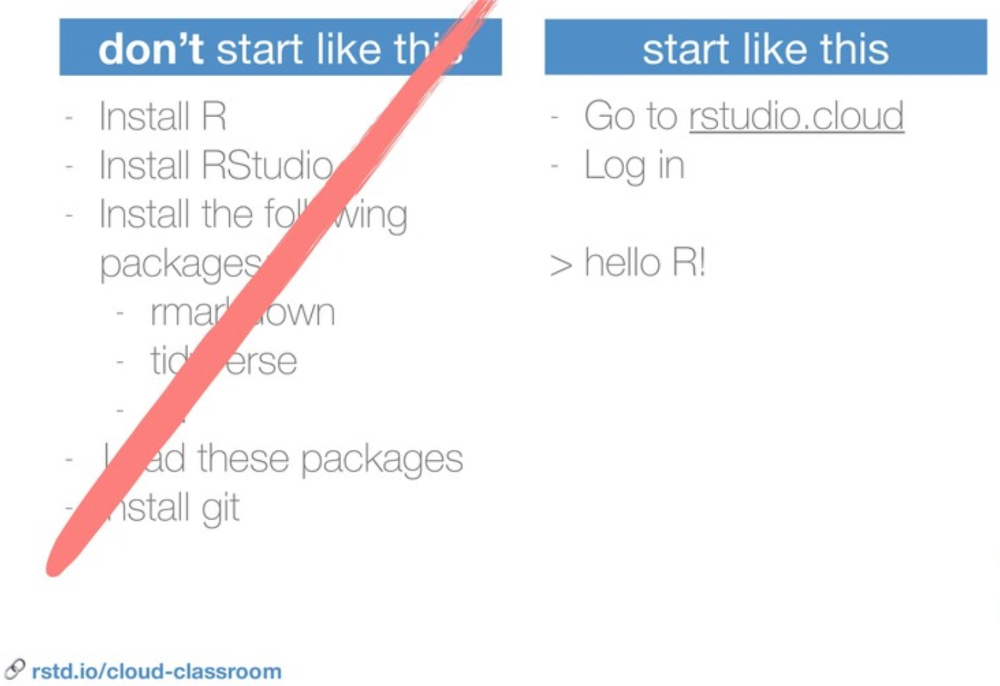
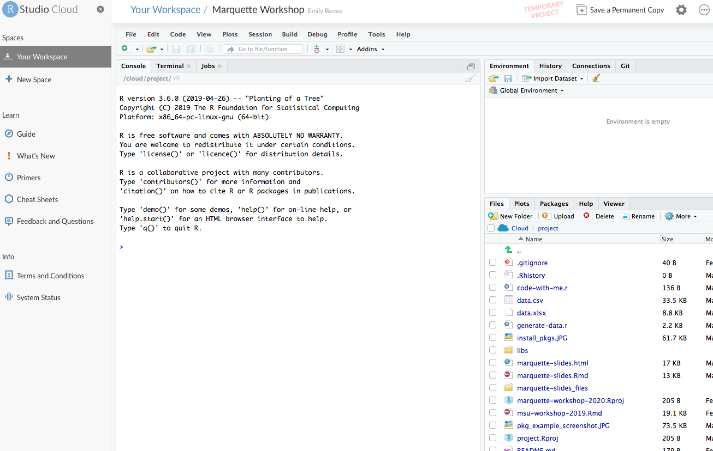
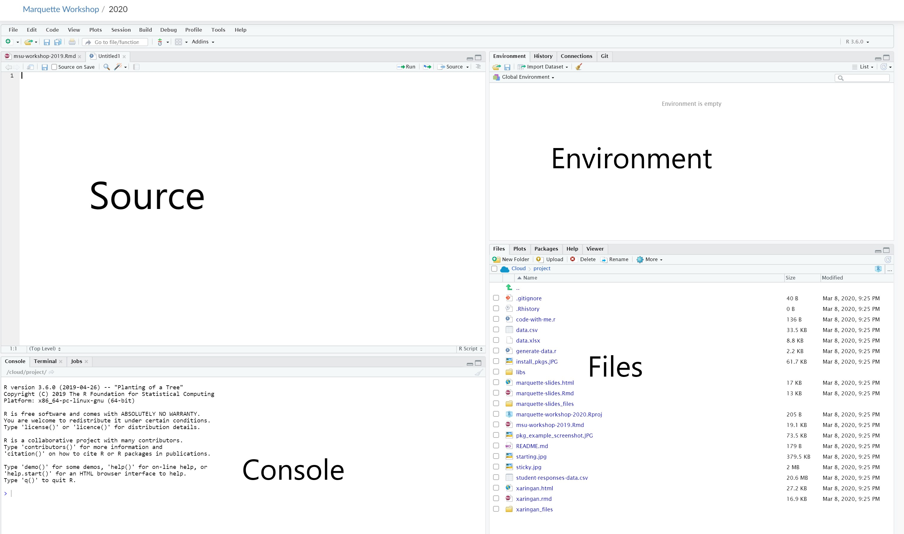

```{r setup, include=FALSE}
options(htmltools.dir.version = FALSE)
library(knitr)
library(tidyverse)
```

# Who am I?

.pull-left[
* Dr. Emily Bovee
* Director of Educational Development and Assessment: Marquette University School of Dentistry
* Cat mom
* I love:
  * Supporting student motivation
  * Using data to answer questions
  * Data science education 
]

```{r, out.width = "350px", echo = FALSE, fig.align = "center"}

```

```{r, out.width = "250px", echo = FALSE, fig.align = "center", out.extra="style='transform:rotate(90deg);'"}
include_graphics("helping.jpg")
```
---

class: inverse, center, middle

# Agenda

---

# Agenda

1. Getting Started with RStudio
1. Vignettes and Functions
1. Loading data
1. Processing data
1. Analyzing data 
1. Learning and doing more with R
1. Questions

---


class: inverse, center, middle

# Section 1: Getting Started with RStudio

---

# Why learn R?

* It is capable of carrying out basic and complex statistical analyses

* It is able to work with data small (*n* = 30!) and large (*n* = 100,000+) efficiently

* It is a programming language and so is quite flexible

* There is a great, inclusive community of users and developers (and teachers)

* It is cross-platform, open-source, and freely-available

---
# My teaching approach for today

* *MAIN GOAL:* Get you up and running with coding in R as soon as possible

- Show you what's possible in terms of data manipulation and analysis

- We will NOT be spending a lot of time troubleshooting tech and software/hardware issues

- Instead, we will focus on exposure to a variety of data processing tools

- You will get access to the code and all files after the workshop so you can practice on your own

- I will share a list of resources at the end to facilitate your learning

---
# Wait, I'm not installing the software?????

  - Installing R can take 20 minutes, depending on your computing setup
  
  - Not everyone is using their own machine
  
  - Our time is valuable here today, so I want to get you off the ground with some new coding skills
  
  - Hopefully our work here today will motivate you to go through the installation of R later!
  
  - There are lots of helpful overviews about how to do install R, and one is chapter 5 of our book: www.datascienceineducation.com 

- Image credit: Mine Çetinkaya-Rundel

```{r, out.width = "350px", echo = FALSE, fig.align = "center"}

```
---
# Where to begin

- R is the engine

- RStudio is the steering wheel & the gas pedal

- Can't get anywhere without the engine, but we never interact with the engine directly

- R = language ; RStudio = Integrated Development Environment (IDE)

---
# Code with me:

- Our task: Open R Studio cloud

- Visit this URL https://rstudio.cloud/

- Sign up

- Join our shared workspace at the link that was emailed to you


```{r, out.width = "350px", echo = FALSE, fig.align = "center"}

```
---
# Hi, RStudio: Four Panes

  - When you open RStudio, you will see four panes. These are for:
    - Source
    - Console
    - Environment
    - Files
    
```{r, out.width = "600px", echo = FALSE, fig.align = "center"}

```
---
# Hi, RStudio: Data & the Environment

  - Data can live:
  
      - in a folder on your computer (e.g. Desktop)
      
      - on the cloud (e.g. Google Drive)
      
      - on the internet (e.g. a dataset from the government that will update without any input from you)
      
---
# Hi, RStudio: Data & the Environment
    
  - Interacting with data in R:
    
    - We need to first tell R where to look for the data
    
    - Once we have done that, the data will be loaded into our Environment
  
    - You can load data into your Working Environment to manipulate it and interact with it, but your original data remains untouched.

---
# Hi, RStudio: Source (Code)
  - The coding pane is at the top left
  
  - Need to save code files
  
  - There are different types of files: 
    -  .r is an R Script
    -  .Rmd is R Markdown (for including narrative with code)
  
  - Today, we will use a .R file (R Script)
```{r, out.width = "600px", echo = FALSE, fig.align = "center"}

```
---
# Code with me: Open an R Script

- In the Files section (bottom right), click the file called
*code-with-me.r*

---
# Hi, RStudio: Files

  - At the bottom right, you can see the files in your working environment
```{r, out.width = "600px", echo = FALSE, fig.align = "center"}

```
---
# Hi, RStudio: Console

- As we code, the Console keeps a running log of what we've done.

- Can also code in the Console, but that is generally not good practice because it disappears as soon as you close R

```{r, out.width = "600px", echo = FALSE, fig.align = "center"}

```
---
# Running Code

- To run code in R, you can

  - Highlight the line and click the Run button at the top right
  
  - Put your cursor on the line that you want to run, then hold Control and tap Enter 
  
    - On a Mac: Hold Command and tap Enter

```{r, out.width = "600px", echo = FALSE, fig.align = "center"}
include_graphics("run.jpg")
```
---
# Packages

"Packages" are shareable collections of R code that provide functions (i.e., a command to perform a specific task), data and documentation. Packages increase the functionality of R by improving and expanding on base R (basic R functions). 

---
# See what packages you have
```{r, out.width = "350px", echo = FALSE, fig.align = "center"}
include_graphics("pkg_example_screenshot.jpg")
```

---
# Installing and Loading Packages

To download a package, you must call `install.packages()`:

```{r, eval = FALSE}
install.packages("tidyverse")
```

You can also navigate to the Packages pane, and then click "Install", which will work the same as the line of code above. This is a way to install a package using code or part of the R Studio interface. 

```{r, out.width = "350px", echo = FALSE, fig.align = "center"}
include_graphics("install_pkgs.jpg")
```
Usually, writing code is a bit quicker, but using the interface can be very useful and complimentary to use of code. 

---
# Using packages

*After* the package is installed, it must be loaded into your R Studio session using `library()`:

```{r}
library(tidyverse)
```

We only have to install a package once, but to use it, we have to load it each time we start a new R session.

> A package is a like a book, a library is like a library; you use library() to check a package out of the library
> - Hadley Wickham, Chief Scientist, R Studio

---

# The tidyverse

The tidyverse is a set of packages for data manipulation, exploration, and visualization using the design philosophy of 'tidy' data. Tidy data has a specific structure: each variable is a column, each observation is a row, and each type of observational unit is a table.

The packages contained in the Tidyverse provide useful functions that augment base R functionality.

You can installing and load the complete tidyverse with:

```{r, eval = FALSE}
install.packages("tidyverse")
```

```{r, message = FALSE}
library(tidyverse)
```

---
# Quick guide to notation in R

- <- is the assignment operator. It means "save as"

- %>% is the "pipe" operator. It means "then"

- The comment operator is #. It means "ignore everything on this line"

- () are how we give sub-commands to R. We might give R a command and then use () to give more specific instructions.

---
# Notation: <-
Using the assignment operator, we can save a changed dataset
```{r, eval=FALSE}
changed_data <- data()

```

---
# Notation: %>% 

- %>% means Then or Next

- It lets you *compose* functions. It does this by passing the output of one function to the next.

- It is handy for stringing multiple commands together
---
# Notation: #
 
When we type # , we tell R to ignore everything that follows

```{r}

#do not run this... student_data <- student_data %>% select(var1, var2, var3)

#student_data <- student_data %>% select(var1, var2, var3)

#comments are useful for notes to self

#people also use comments to exclude lines of code for now
  #but save them for later

```
---
#Notation: ()

We use () to indicate more specific commands to R.

The () is where we supply each function's *arguments*.
---
# Notation: Putting it all together
<- 

%>% 

#

()

```{r, eval = FALSE}
#Sample code:
averageGradeData <- data %>%   #Take grade data called "data" 
                                #and save it as "averageGradeData"
 group_by(Last, course_sem) %>%  #Then, group by course and semester
  summarize(avgGrade = mean(`Grd Pt/Unt`, na.rm = TRUE)) %>% 
                  #Then, create a new column for 
                  #"average grade" and name it avgGrade
                  #in this new column, take the average of all the 
                  #grades (within a course/semester)
  view #then show me the result
```
---
class: inverse, center, middle
# Section 2: Vignettes and Functions

---
# Vignettes

Vignettes are long-form documentation (and tutorials) that can provide a helpful introduction to a package.

Run `vignette()` in order to view *all* of the vignettes available for a package:

```{r, eval = FALSE}
vignette(package = "dplyr")
```

Then, you can load a specific vignette.

```{r, eval = FALSE}
vignette("dplyr", package = "dplyr")
```

These are also available through CRAN (i.e., https://cran.r-project.org/web/packages/dplyr/index.html)
---

# Using a specific function

If you know the specific function that you want to look up, you can run this in the R Studio console:

- Here, we use the double colon `::` to indicate that we want to use the `filter` function from within the `dplyr` package.
  - The format is `?package::function`

```{r, eval = FALSE}
?dplyr::filter
```

---
#Using a specific function
Once you know what you want to do with the function, you can run it in your code:

```{r}
dat <- # take everything I do below and save it as an object "dat" 
  tibble(letter = c("A", "A", "A", "B", "B"),
         number = c(1L, 2L, 3L, 4L, 5L)) #creates a tibble format of data
filter(dat, letter == "A")
```

---
class: inverse, center, middle

# Section 3: Loading Data
---

# Data processing with the *tidyverse*

- I use the `tidyverse` packages to do data science tasks

- For these packages to work, our data needs to be in the format of a *tibble*

- A *tibble* is a data frame, but with some tighter rules.

- For now, it's important to understand that however you read your data in - from a spreadsheet, from a Google sheet, or from the internet - you can transform it into a *tibble* and can do fun data processing and analysis tasks after that

---
# Where does my data "live"?

- Need to tell R where to look for your data

- This is called a Working Directory

- We can specify the working directory with our mouse

- We can also specify the working directory with code

- For now, it makes sense to store your data in the same place as your code

---
# Code with me: load data
- In your code file, run the part of the code labeled "Load Data"

```{r, echo = FALSE}
#Here we load the data and save it as an object "data"
data <- read_csv("data.csv")

#We can call it anything we want
pasta <- read_csv("data.csv")
```
- Try checking out the "data" and "pasta" objects in the environment
---
class: inverse, center, middle

# Section 4: Processing Data
---

# Some data processing basics

- Always use the assignment operator <- to save a new version of the object
    - Otherwise, you will not maintain your data processing work

- Remember that you are not changing the file on your computer (or on the cloud), so it is very important to save your code file

- Can save the processed data file when you are done

- Everything is reversible, so try stuff out!
---
#Task: Check out the data
`str(data)` gives us an overview of the types of all of the data columns at once

Try typing this code:
```{r}
str(data)
```

---
#Task: Check out the data more

`colnames(data)` gives us an overview of all the variable names

```{r, echo=FALSE}
str(data)
```
---
#The data is always available

Note that we have been checking out the data with code. You can also always view it by clicking the dataset's name in the Environment pane.
---
# About our dataset

- It includes 6 variables

  - Student ID number

  - Interest in learning R (I like it)
  
  - Expectation of capability to learn R (I think I can do it)
  
  - Whether student attended tutoring in the past year
  
  - Whether student attended advising in fall semester
  
  - Whether student attended advising in spring semester

- I generated it for this workshop, so it's not real data

---
#Task: Variable Renaming

- To rename a variable, we use "rename" from the `dplyr` package
  - `dplyr` is part of the `tidyverse` group of packages
  
- The format for the rename function is 
  - rename(new = old)
  - Remember that we can learn more about it by typing 
```{r, eval = FALSE}
?dplyr::rename
```

```{r, eval = FALSE}
#Sample code

classof2016 <- classof2016 %>% 
  rename(First = "First Name",
         Last = "Last Name")
```
---
#Code with me: Variable Renaming

- Let's try renaming a variable in our data

```{r}
#Without saving

data %>% rename(testing123 = tutoring)
  #What do you see in your console (bottom left) after running this code?

#With saving

data <- data %>% 
        rename(tutor = tutoring)
```

---
#Task: Selecting
`select()` reduces the number of *columns* of a dataset.
```{r, eval = FALSE}
data_mot_vars <- # save a new object student_mot_vars by...
  data %>% # using dataframe student_responses
  select(int, expect) # and selecting only these two variables

#Now check out the new dataset
data_mot_vars
```

---
#Code with me: Selecting

- Try filling out the rest of this code to select only the advising data and student ID data
- Remember that variable names need to be separated by commas

```{r, eval = FALSE}

data_advising <- 
  data %>% 
  select(StudentID, , )

```

- How many observations (rows) are in your new dataset?

- How many variables (columns) are in your new dataset?

---
#Task: Mutating
`mutate()` takes instructions to create a new variable.
What goes *before* the equals sign is the name of the new variable.
What goes after are the instructions.

- We can do this by modifying existing variables, or we can create a new variable with values we choose

- Below, we will take our dataset and create a new variable to sum both "motivation" data points

- This will be the sum of the *int* and *expect* variables

```{r}
library(tidyverse)
data <- data %>%
  mutate(motivation = (int + expect))
```
---
# Code with me: Mutate

- Try creating a new variable in the dataset that represents the total number of advising sessions attended

- This will be the sum of the *spr_adv* and *fall_adv* variables

- Save the new dataset as *awesome*

```{r, eval = FALSE}

_____ <- data %>% 
  mutate(____ = )

```

---
# Code with me: Mutate
- How did it go?

- Try running the code below to check whether your new variable exists
```{r, eval = FALSE}
colnames(awesome)
```

- Can also visually inspect to see whether the sum makes sense across a couple of rows. 
---
#Task: Filtering
`filter()` takes *logical statements* (statements that can evalute to true or false) to select a number of *rows* from a dataset.]

Notice that in the code below, we do not save an object with the `<-` assignment operator. The filtering will display in our viewer, but our data is unchanged. 
```{r,eval = FALSE}
#Filter without saving

data %>% filter(tutoring == 0)

```
---
# Code with me: Filter

- Try filtering the data by using your own criteria.
---
#Task: Move a variable to the front 
- We can do this with the `select` function

- The below sample code comes right from the *documentation* for `select`

- Remember that you can access the documentation for a function at any time by typing a question mark into your console like this
 `?dplyr::select`
 
```{r, eval = FALSE}
# Move Species variable to the front
select(iris, Species, everything())

```
---
# Code with me: Move a variable forward

- Fill in the following code with a variable you'd like to move to the front

```{r, eval = FALSE}
select(data, ______, everything())
```
---

#Chaining commands

- We can stack commands using the %>% operator

```{r}
data %>%
  mutate(motivation = (int + expect)) %>% 
  filter(tutor == 0) %>% 
  view
```


#Task: Saving out my processed dataset

- For this, we can use the readr function from within the tidyverse

- Using our data frame `data`, we can save it as a CSV (for example) with the following function. The first argument, `data`, is the name of the object that you want to save. The second argument, `data_after_workshop.csv`, what you want to call the saved dataset.
```{r, eval = FALSE}
write_csv(data, "data_after_workshop.csv")
```
That will save a CSV file entitled `data_after_workshop.csv` in the working directory. If you want to save it to another directory, simply add the file path to the file, i.e. `path/to/data_after_workshop.csv`. 

To save a file for SPSS, load the `haven` package and use `write_sav()`. 

There is not a function to save an Excel file, but you can save as a CSV and directly load it in Excel.

---
class: inverse, center, middle

# Section 5: Analyzing Data

---
# Linear models
- The `lm()` function is a very helpful general purpose function for linear models. 

- The basic format is:
outcome ~ predictor1 + predictor2 + predictor3, 
            data = dataset_i_want_to_use

---
# Linear models
Let's try predicting interest in learning R.
```{r}
lm(int ~ expect, data = pasta)
```
---
# Linear models
Let's save the results back to an object, `m1`.
```{r}
m1 <- lm(int ~ expect, data = pasta)
```
---
# Linear models
We can then run a summary on the output.
```{r}
summary(m1)
```
---
# Linear models
You can then build up a more complex model by using the + sign to separate different predictors, i.e.:
```{r, eval}

m2 <- lm(int ~ expect + tutoring + fall_adv + spr_adv, 
         data = pasta)
```
You can then run `summary()` to view the results.

```{r}
summary(m2)
```
---
# Linear models - you try

- Write a linear model to predict the outcome of your choice from the dataset "data" or "pasta"

---
class: inverse, center, middle

# Section 6: Learning and doing more with R

---
# Installations

To download R:
- Visit this page to download R: https://cran.r-project.org/
- Find your operating system (Mac, Windows, or Linux)
- Download the 'latest release' on the page for your operating system and download and install the application

To download R Studio:
- Visit this page to download R studio: https://www.rstudio.com/products/rstudio/download/
- Find your operating system (Mac, Windows, or Linux)
- Download the 'latest release' on the page for your operating system and download and install the application

## Check that it worked

Open R Studio.  Find the console window and type in `2 + 2`. If what you can guess is returned (hint: it's what you expect!), then R Studio *and* R both work.

---
# Resources
  - [Doing data science with R](https://r4ds.had.co.nz/) by Wickham and
    Grolemund (2017)
  - [Big magic with R: Creating learning beyond
    fear](https://speakerdeck.com/apreshill/big-magic-with-r-creative-learning-beyond-fear)
    by Hill (2017)
  - [Data science in education](https://github.com/data-edu/data-science-in-education)

---
# Courses

  - [\#r4ds](https://medium.com/@kierisi/r4ds-the-next-iteration-d51e0a1b0b82)
    (see a talk at rstudio::conf()
    [here](https://resources.rstudio.com/rstudio-conf-2019/r4ds-online-learning-community-improvements-to-self-taught-data-science-and-the-critical-need-for-diversity-equity-and-inclusion-in-data-science-education)
    by Mostipak (2019))
  - [Data science for social scientists](http://datascience.tntlab.org/) by
    Landers (2019)
  - [University of Oregon Data Science Specialization for the College of
    Education](https://github.com/uo-datasci-specialization) by Anderson (2019)

---
# Forthcoming Book

Data Science in Education using R

By Emily A. Bovee, Ryan A. Estrellado, Jesse Mostipak, Joshua M. Rosenberg, and Isabella C. Velásquez

www.datascienceineducation.com

```{r, out.width = "350px", echo = FALSE, fig.align = "center"}

```
---
# Workshop Evaluation

- Not for research purposes, but just to let Dr. Rosenberg and I know how this went

- Especially interested in feedback about the RStudio Cloud experience

bit.ly/survey3920

---
# Thanks!

Contact me via email: emily.bovee@marquette.edu 

Contact me via Twitter: @ebovee09

Contact Dr. Joshua Rosenberg: @jrosenberg6432

Slides created via the R package [**xaringan**](https://github.com/yihui/xaringan).

The repository for this workshop is [here](https://github.com/emilybovee/marquette-workshop-2020).
